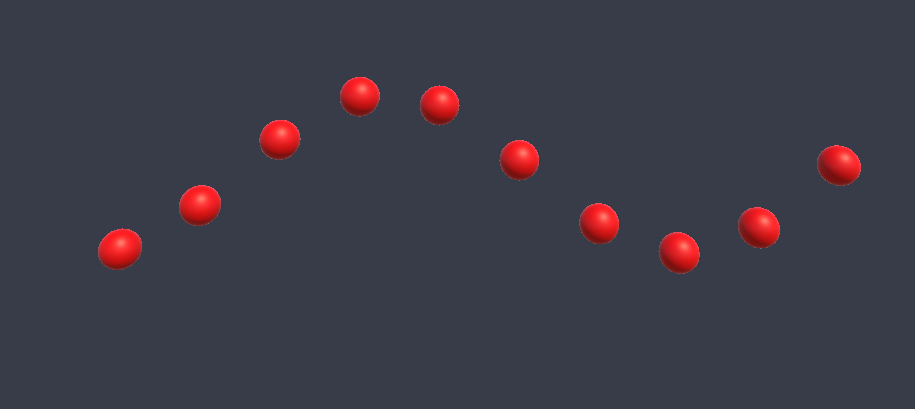

# Unity Compute Shader Examples

According to the [documentation](https://docs.unity3d.com/Manual/class-ComputeShader.html) Compute Shaders are shader programs that run on the GPU, outside of the normal rendering pipeline. Since, they use CPU instead of GPU as hardware, they can be more performant in some scenarios. For example [Visual Effect Graph](https://docs.unity3d.com/Packages/com.unity.visualeffectgraph@17.0/manual/index.html) use them to simulate particles.

## Example Cases

There are two main usages of Compute Shaders, such as manipulating textures and simulation (processing data on GPU instead of CPU). This repository includes three example cases which cover both usage areas.

**Basic Compute Shader:** A basic compute shader which converts input texture into a grayscale texture.
  

**Compute Buffers:** An example which demonstrates the usage of compute buffers with Compute Shaders. This example allows you to draw circles on a texture dynamically at runtime. You can use this technique to draw fake shadows on the ground when you disable shadows from renderers because of performance reasons.
  

**Simulation with Compute Shaders:** This example shows how to use Compute Shaders to do necessary calculations on GPU instead of CPU. If you are already CPU bounded or there are too many calculations to be done, then it is better to use GPU rather than CPU. This example calculates positions of Game Objects to be able to simulate a sinusoidal wave. 

